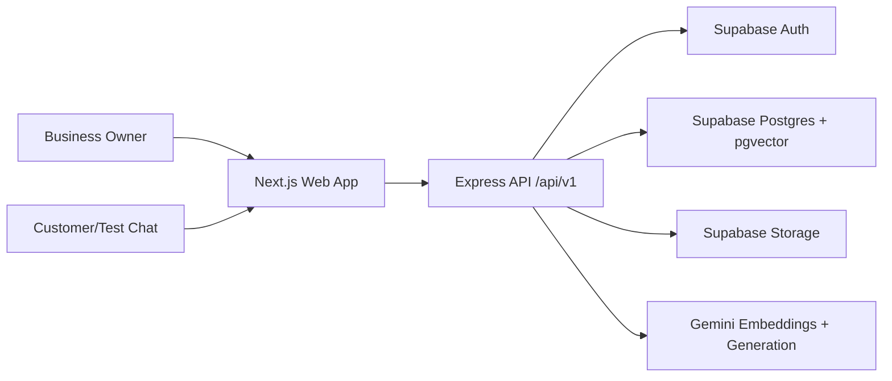

# SupportAI Design

## Architecture

SupportAI uses a modular monorepo with a Next.js web app, Express API, shared TypeScript contracts, Supabase managed services, and Gemini AI.

## Data Flow

Document upload stores the raw file in Supabase Storage, creates a document row, extracts text, chunks content, requests Gemini embeddings, and stores vectors in `document_chunks`. Chat embeds the question, calls `match_document_chunks`, sends retrieved context to Gemini, persists messages, and records analytics.

## Boundaries

- Internal: Next.js UI, Express API, shared contracts, migrations, docs.
- External: Supabase, Gemini, Vercel, Render.
- Tenant boundary: `business_id` on every tenant-owned table plus RLS policies.

## UI

The MVP UI is a compact operational dashboard with authentication, business setup, upload management, FAQ management, chat testing, and analytics. It is mobile responsive and uses restrained colors for repeated business workflows.
